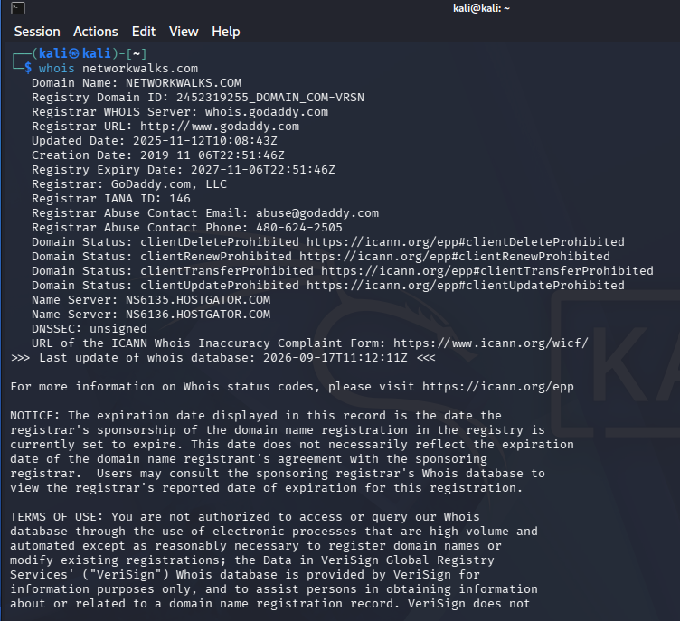
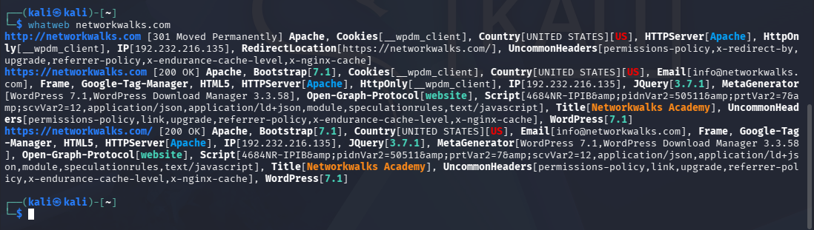
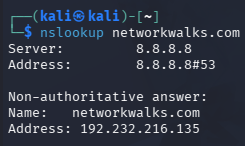
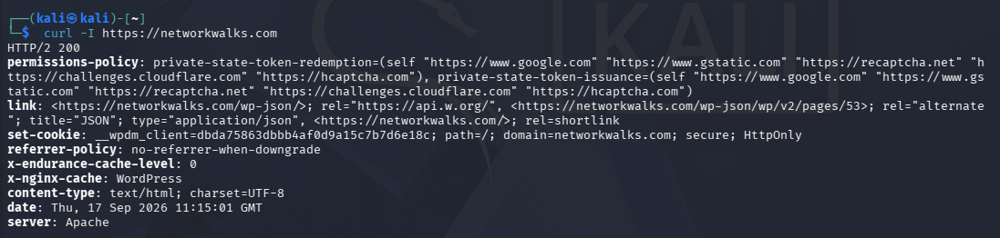
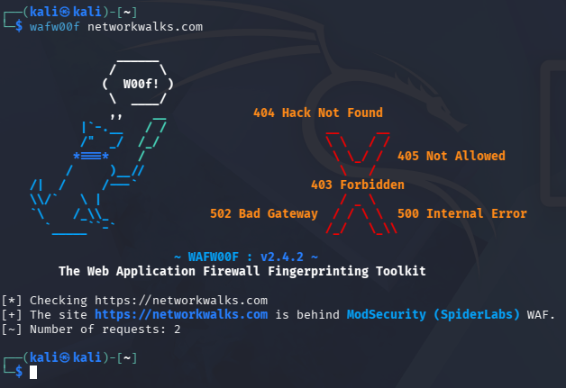
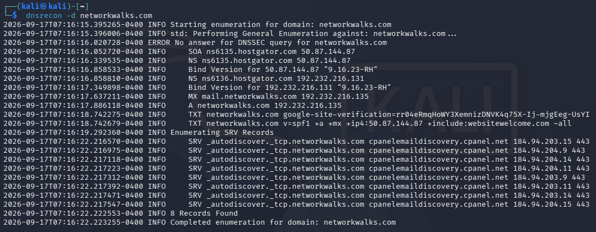
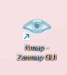
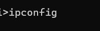
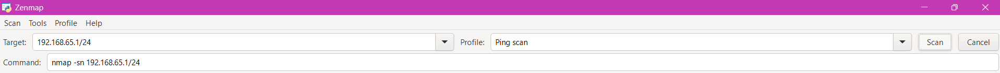
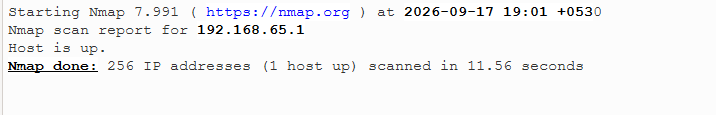

🔐 Week 2 — Footprinting & Network Scanning

Reconnaissance with Multiple Kali Linux Tools and Network Discovery with Zenmap

  
  
  
  
  
  
  
  
  

## 📌 Project Overview

This project covers two Week 2 cybersecurity activities:

Footprinting & Reconnaissance with Multiple Kali Linux Tools (W2-PM1)

Network Scanning with Zenmap (W2-PM5)

The first activity focuses on gathering publicly available information about the networkwalks.com domain using multiple reconnaissance tools.

The second activity focuses on discovering live hosts on my own local LAN using Zenmap and identifying their IP and MAC addresses.

Together, these activities demonstrate how a security professional can move from public information gathering to network discovery during the reconnaissance and scanning phases of a penetration test.

## 🎯 Objectives

The main objectives of this project are to:

Perform domain footprinting using multiple Kali Linux tools.

Collect publicly available domain registration information.

Fingerprint web technologies and services.

Resolve the domain name to its IP address.

Inspect HTTP response headers.

Identify whether a Web Application Firewall is present.

Enumerate DNS records.

Find the local IP address and LAN subnet.

Discover live hosts on the local network.

Identify IP and MAC addresses of discovered hosts.

Generate and save a network topology using Zenmap.

Document observations, risks, and security recommendations.

## 🛡️ Scope & Ethical Use

All activities in this project were performed only on systems where I had authorization or on devices/networks that I own.

The footprinting activity was performed against the networkwalks.com domain as part of the assigned educational practical.

The network scanning activity was performed on my own local LAN network.

⚠️ Important: Reconnaissance and scanning should only be performed against systems and networks where appropriate authorization has been provided. Unauthorized access or scanning may violate laws, policies, or organizational rules.

## 🧩 Module 1 — Footprinting & Reconnaissance

🔎 What is Footprinting?

Footprinting, also called reconnaissance, is the process of collecting information about a target before performing further security testing.

In this activity, six Kali Linux tools were used:

WHOIS

WhatWeb

Nslookup

Curl

Wafw00f

DNSRecon

Each tool reveals a different type of information about the target and helps build an overall profile of the publicly exposed infrastructure.

🛠️ Tools Used

🧰 Tool

🎯 Purpose

whois

Find domain registration details, dates and name servers

whatweb

Fingerprint web technologies, CMS, plugins and server information

nslookup

Resolve the domain name to its IP address

curl -I

Inspect HTTP response headers

wafw00f

Detect whether a Web Application Firewall is protecting the site

dnsrecon

Enumerate DNS records such as NS, MX, SPF, TXT and SRV

🪜 Footprinting Procedure

## Step 1. WHOIS — Domain Registration Information

The whois command was used to query publicly available domain registration information.

whois networkwalks.com

The command was used to identify information such as the registrar, registration details, expiry information and name servers.

📸 Evidence

## Step 2. WhatWeb — Web Technology Fingerprinting

WhatWeb was used to identify technologies exposed by the website.

whatweb networkwalks.com

The observed results identified:

WordPress 7.0.4

WP Download Manager 3.3.58

Other web/server information exposed by the website

📸 Evidence

## Step 3. Nslookup — Domain to IP Resolution

Nslookup was used to resolve the domain name to its IP address.

nslookup networkwalks.com

Observed IP address:

192.232.216.135

📸 Evidence

## Step 4. Curl — HTTP Response Headers

The curl -I command was used to inspect the HTTP response headers.

curl -I https://networkwalks.com

The response exposed technical information about the web application, including the WordPress REST API endpoint:

/wp-json/

📸 Evidence

## Step 5. Wafw00f — Web Application Firewall Detection

Wafw00f was used to identify whether the website was protected by a Web Application Firewall.

wafw00f networkwalks.com

The observed result identified:

ModSecurity (SpiderLabs)

📸 Evidence

## Step 6. DNSRecon — DNS Enumeration

DNSRecon was used to enumerate DNS records associated with the domain.

dnsrecon -d networkwalks.com

The results provided information related to:

Name servers

Mail servers

SPF/TXT records

Service records

DNS software information

📸 Evidence

## 💡 Why Footprinting Matters

Footprinting is an important stage of cybersecurity because it allows a security professional to understand what information an organization exposes publicly.

The tools used in this activity provided information about:

Domain registration

Hosting and name servers

Web technologies

Server IP address

HTTP headers

WAF technology

DNS infrastructure

These observations can help defenders understand what an external party can learn about their environment and identify information that may require review.

## 🌐 Module 2 — Network Scanning with Zenmap

## 📌 Project Overview

Zenmap is the graphical user interface for Nmap. It provides an easier way to perform Nmap-based network scanning and can be used by both beginners and experienced security professionals.

The practical required the following:

Find the local IP address.

Identify the local LAN subnet.

Discover live hosts.

Count the live hosts.

Identify their IP addresses.

Identify their MAC addresses.

Generate and save a network topology in PDF format.

🪜 Network Scanning Procedure

## Step 1. Install Zenmap

Zenmap was installed on the Windows PC for network discovery.

Official Nmap download page:

https://nmap.org/download.html

📸 Evidence

## Step 2. Find Local IP Address & LAN Subnet

The Windows Command Prompt was opened and the following command was used:

ipconfig

This command was used to identify the local IPv4 address and LAN subnet.

📸 Evidence

Note: The subnet and IP addresses can differ depending on the local network configuration.

## Step 3. Find Live Hosts Using Zenmap

Zenmap was opened and the local LAN subnet was entered as the target.

A Ping Scan was selected to identify active hosts on the subnet.

Example scan configuration:

Scan Type: Ping Scan
Target: Local LAN subnet

📸 Evidence

## Step 4. Number of Live Hosts

I have identified 1 host
This included the PC used for the scan.
📸 Evidence

## Step 5. IP Addresses of Live Hosts
📸 Evidence

 

## Step 6. MAC Addresses of Live Hosts

The local machine's MAC address was checked using: ipconfig /all
📸 Evidence

## Step 7. Generate Network Topology

After completing the scan, the Topology section in Zenmap was opened.

The legend was enabled and the topology was reviewed.

The topology was then saved as a PDF file.

📸 Evidence

The generated topology PDF can be included in the final project evidence.

📊 Findings & Risk Analysis

#

🔎 Finding

🧾 Observation

🎯 Potential Impact

| # | 🔎 Risk / Finding | 🧾 Evidence / Observation | 🎯 Potential Impact | ⚠️ Risk Level |
|---|-------------------|---------------------------|---------------------|---------------|
| 1 | Web technology information exposed | WordPress and WP Download Manager identified | Exposed technology/version information can assist further security review | 🟠 Medium |
| 2 | Server IP identifiable | Domain resolved to `192.232.216.135` | Provides information about the web service location | 🟢 Low |
| 3 | HTTP technical information exposed | HTTP headers and `/wp-json/` were exposed | May assist technology fingerprinting and further enumeration | 🟢 Low |
| 4 | WAF technology identifiable | ModSecurity (SpiderLabs) identified | Reveals information about the web application's security architecture | 🟢 Low |
| 5 | DNS infrastructure information exposed | DNS, mail and service-related records identified | Can help build a broader infrastructure profile | 🟠 Medium |
| 6 | Multiple live hosts visible on local network | Four live hosts were identified in the example network | Unknown or unauthorized devices may potentially be present | 🟠 Medium |
Note: These findings are observations from footprinting and scanning exercises, not confirmed vulnerabilities. No exploitation or vulnerability validation was performed as part of these two modules.

## 🔐 Security Recommendations

Based on the observations from these activities:

Review publicly exposed technology information
Organizations should regularly review information about their web technologies, CMS platforms and plugins that is publicly visible.

Keep software updated
CMS platforms, plugins and other web technologies should be regularly updated and reviewed against current security advisories.

Review HTTP headers
HTTP response headers should be reviewed to determine whether unnecessary technical information is being exposed.

Review DNS records regularly
DNS records should be checked periodically to ensure that only required information and services are publicly exposed.

Properly configure and monitor the WAF
The existing WAF should remain enabled and properly configured.

Perform regular internal network discovery
Organizations should periodically scan their own networks to identify active devices.

Investigate unknown devices
Unexpected devices discovered during network scanning should be investigated and verified.

Maintain network documentation
Network topology and device information should be documented and updated regularly.

Perform security testing with authorization
Reconnaissance and scanning should only be performed against systems and networks where appropriate authorization has been provided.

## 🧠 What I Learned

Through this Week 2 project, I learned how reconnaissance and network discovery fit into a cybersecurity assessment.

1. Footprinting & Reconnaissance

I learned how publicly available information can reveal useful details about a target domain without performing exploitation.

2. Multiple Reconnaissance Tools

I learned that different tools provide different pieces of information:

whois → domain registration information

whatweb → web technology fingerprinting

nslookup → IP address resolution

curl → HTTP response headers

wafw00f → WAF detection

dnsrecon → DNS enumeration

3. Network Scanning

I learned how Zenmap can be used to discover live hosts within an authorized local network.

4. IP & MAC Address Identification

I learned how to identify local network information and understand the relationship between IP addresses and MAC addresses during network discovery.

5. Network Topology

I learned how Zenmap can represent discovered hosts visually through its topology feature and how to save the topology as a PDF.

6. Security Documentation

I learned that cybersecurity findings should be documented clearly, including:

What was performed

What was discovered

What the observation means

What potential risk it creates

How the risk can be reduced

7. Authorized Testing

Most importantly, I learned that reconnaissance and scanning must always be performed within an authorized scope.
The project evidence includes screenshots and outputs from:

WHOIS

WhatWeb

Nslookup

Curl

Wafw00f

DNSRecon

Windows ipconfig

Zenmap Ping Scan

Zenmap Topology

## Final Penetration Testing report
📄

## 🔗 Tools & Resources

Nmap / Zenmap: https://nmap.org/download.html

NetworkWalks: https://networkwalks.com

## 👤 Author

Parul Bhople
Cybersecurity Intern, Networkwalks

LinkedIn: https://www.linkedin.com/in/parul-b-b7b4a22a8/

📌 Project Information

Program Name: Cybersecurity Program at Networkwalks | Week: 02 | Projects: W2-PM1 Footprinting & Reconnaissance + W2-PM5 Network Scanning with Zenmap | Repository: GitHub
